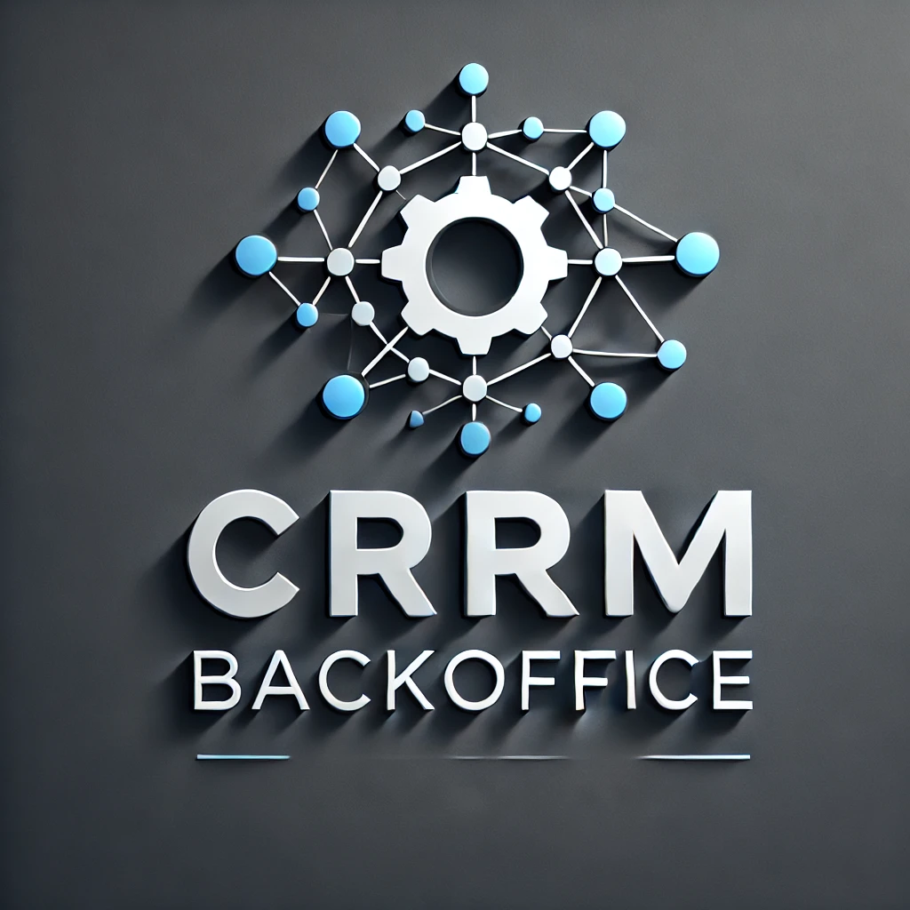

# backoffice
**BackOffice CRM system.**

    

## How to run
1. Configure `.env` file from `.env.sample`. 
2. Run command: 
`docker compose up --build` 
3. Find containers ID: 
`docker ps` 
4. Open sh for web service and migrate: 
`docker exec -it <container id> sh` 
`cd backoffice_crm` 
`python manage.py migrate` 
5. Create super-user: 
`python manage.py createsuperuser`
6. Run command to create roles: 
`python manage.py create_roles`
Check if db in container is migrated: 
`docker exec -it <container id> sh` 
`psql -U <user login> <dbname>` 
`\dt` 
You'll see new tables.
## Usage
1. Open `127.0.0.1:8000/admin` and log in as a superuser. Create user, place him to the group "administrator" and set staff status.
2. Go to profiles and set to new user role administrator. 
3. Log in as a new user. Using him you can access to admin panel and create other users with roles operator, manager, marketer.
## Powered by Django, PostgreSQL and Docker

    
    
    

